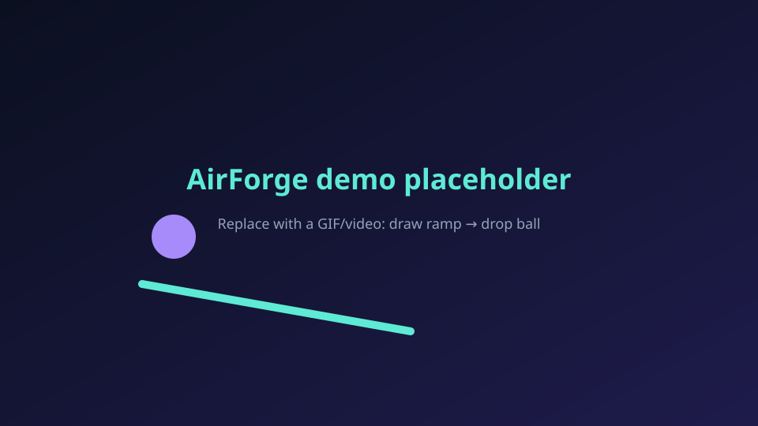

# AirForge

**Draw shapes in air (or with a mouse) → forge them into Rapier rigid bodies.**

A browser physics playground with a science-exhibit feel: dark theme, restrained neon, real collisions. Works fully **without a webcam**.

> 
>
> *Replace this with a short GIF/video of the hero demo (draw ramp → drop ball).*

## Inspiration & attribution

AirForge is **inspired by** [WritingOnAir](https://github.com/CodeItAlone/WritingOnAir) by **CodeItAlone / Subrato Kundu** (MIT License, Copyright (c) 2025 CodeItAlone — see `Backend/LICENSE` upstream and [`THIRD_PARTY_NOTICES.md`](./THIRD_PARTY_NOTICES.md)).

**We did not invent** the core air-writing gesture/shape ideas. WritingOnAir is a Python OpenCV + MediaPipe desktop app. AirForge is a different product: a **browser** 2.5D physics forge with a pure TypeScript recognizer **informed by** those heuristics (reimplemented — not a Python server, not a line-for-line port).

### What came from WritingOnAir vs what we built

| From WritingOnAir (inspiration) | Built in AirForge |
|---------------------------------|-------------------|
| Index-only = draw | Same gesture mapping in browser HandLandmarker |
| Pinch = pen up | Same |
| Open palm = erase | Mapped to cancel / erase intent in playground |
| Mode hysteresis (3 frames) | Reimplemented TS state machine |
| Point smoothing (window 4) | Reimplemented in `stroke/` |
| Max lost frames 2 | Cancel stroke — never connect distant points |
| Shape priority line → circle → rect/square | Pure TS in `shapes/` |
| Line deviation ratios; circle MEC + coverage; rect hull + poly approx | Reimplemented without OpenCV |
| — | Rapier physics, ramps/balls/platforms |
| — | Mouse-first hero demo, save/import JSON, replay |
| — | React 19 + R3F + Vite SPA |

### Comparison: What I built vs original

| | WritingOnAir | AirForge |
|--|--------------|----------|
| Runtime | Python desktop | Browser (Vite SPA) |
| Vision | MediaPipe Hands (Python) | `@mediapipe/tasks-vision` HandLandmarker |
| Drawing | OpenCV canvas / MR overlay | SVG ink + R3F meshes |
| Shapes | Autocorrect to ink shapes | Autocorrect → **physics bodies** |
| Physics | None | Rapier (`@react-three/rapier`) |
| Input without camera | Limited | **First-class mouse path** |
| Persistence | PNG / MP4 | Versioned JSON scenes (no video) |
| License | MIT | MIT (AirForge) + notices for upstream |

## Stack (why each major dependency)

| Dep | Why |
|-----|-----|
| **Vite + React 19 + TypeScript** | Fast SPA tooling, strict types |
| **three** | WebGL scene graph |
| **@react-three/fiber ^9** | Declarative three.js in React 19 |
| **@react-three/drei** | Grid helper, scene ergonomics |
| **@react-three/rapier ^2** | Rigid-body physics (ramps, balls, bounce/friction) |
| **@mediapipe/tasks-vision@1.0.1** | Optional webcam HandLandmarker (CDN wasm/model pinned) |
| **vitest** | Unit tests for recognition, coords, IO, gestures, hero path |

## Architecture

```
src/
  camera/     getUserMedia + typed permission errors
  hand/       HandLandmarker wrapper + gesture SM (hysteresis, hand-loss cancel)
  input/      Mouse/trackpad → same stroke events as webcam
  events/     InteractionEvent types
  stroke/     Capture + smoothing (window 4, max points)
  shapes/     Pure TS recognition + geometric quality metrics
  coords/     Screen↔world, mirroring conventions
  scene/      Ramp / ball / platform model + spawn clearance
  physics/    Gravity, bounce, friction, spawn offset rules
  render/     R3F Canvas, Rapier bodies, ink overlay
  io/         Versioned JSON export/import + validation
  replay/     Event timeline + snapshot playback (honest non-determinism)
  ui/         Toolbar, tutorial, help, suggestion picker, a11y
  fixtures/   Synthetic strokes + example scenes
  eval/       Shape accuracy + timing harness
  store/      App state (no god App.tsx)
```

### 2.5D model & coordinate conventions

- Draw in **2D screen space** (origin top-left, +x right, +y down).
- Map to **world x/y** (origin center, +y up); meshes get **thickness on z**; bodies are **z-constrained**.
- Gravity on **−y**. Perspective camera slightly angled.
- Webcam frames are **mirrored** (selfie). Depth is ignored — **webcam is NOT precise 3D tracking**.

### Spawn offset (no ball-in-collider)

Balls spawn at least `BALL_RADIUS + SPAWN_CLEARANCE` above the top of any ramp/platform under their x, or at `DEFAULT_DROP_Y`. See `src/physics/params.ts`.

## Setup / run

```bash
npm install
npm run dev      # http://localhost:5173
npm test
npm run build
```

Pinned MediaPipe assets (when using webcam):

- WASM: `https://cdn.jsdelivr.net/npm/@mediapipe/tasks-vision@1.0.1/wasm`
- Model: Google `hand_landmarker` float16 v1 storage URL (see `src/hand/landmarker.ts`)

## 30-second demo recording script

1. Open the app → dismiss tutorial (or click **Load Ramp & Ball demo**).
2. Or: click **Try without webcam** (default) → drag a **diagonal** on the canvas → teal ramp appears.
3. Click **Add ball** (or draw a circle).
4. Click **Drop ball** → purple ball rolls down the ramp.
5. Nudge **Bounce** / **Friction**; hit **Pause** / **Undo** / **Reset**.
6. Optional: **Save JSON**, then **Import** to reload.

## Limitations / known issues

- **Webcam was not tested on the machine that built this repo** (`/dev/video*` absent). Do not treat gesture accuracy as measured.
- Shape recognition thresholds are tuned for ~1280×720 stroke pixels; very small canvases may need looser thresholds.
- Rapier playback is **snapshot-based** — physics is not bit-exact across devices; replay restores recorded object states.
- Camera is **fixed** (slight perspective) so screen↔world mapping stays predictable for drawing. The overlay captures pointer input for strokes; there is no free orbit.
- Stretch goals skipped for reliability: two-hand manipulate, shareable URL state.

## Roadmap

**Shipped (M1–M6)**

- Mouse hero demo (ramp → ball → drop)
- Shape recognition (line / circle / rect)
- Rapier physics + params + pause
- Undo / reset / example scenes
- Webcam pipeline + gesture SM (code complete; **not evaluated live here**)
- Save/import JSON + replay snapshots
- Tests, eval fixtures, a11y (keyboard, focus, reduced-motion), docs

**Ideas (not shipped)**

- Two-hand manipulate
- Shareable URL / deep-link scenes
- Multi-ball emitters, joints, explosives toys
- Calibrated depth / true 3D (out of scope for 2.5D)

## Eval methodology

Synthetic stroke fixtures in `src/fixtures/strokes.ts` are run by `src/eval/harness.ts` (also via `npm test`).

- Reports pass/fail per fixture and mean recognition time.
- **Gesture accuracy: not yet evaluated** (no webcam on build machine).

## Manual webcam test checklist (for you)

Use this on a machine with a camera — do **not** invent results:

- [ ] HTTPS or localhost; permission prompt appears
- [ ] Deny permission → clear error + mouse still works
- [ ] No camera → `not_found` message + mouse fallback
- [ ] Index-only draws ink; pinch lifts pen
- [ ] Open palm cancels / does not teleport-connect strokes
- [ ] Cover lens >2 frames mid-stroke → stroke cancelled
- [ ] Gesture chip updates (DRAW / PEN UP / ERASE)
- [ ] Mirrored preview matches muscle memory
- [ ] Mouse overlay still forges shapes while webcam panel open

## License

MIT © 2026 skysssup — see [`LICENSE`](./LICENSE).

Third-party: [`THIRD_PARTY_NOTICES.md`](./THIRD_PARTY_NOTICES.md).
