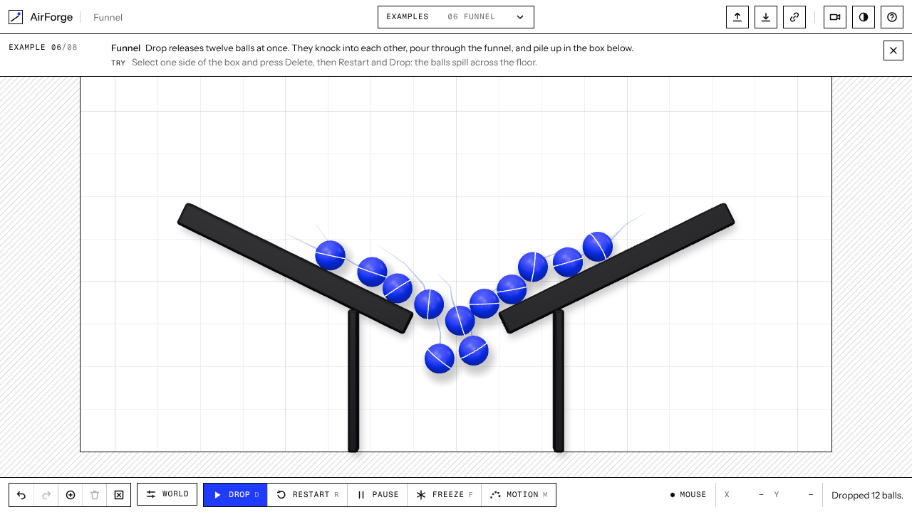
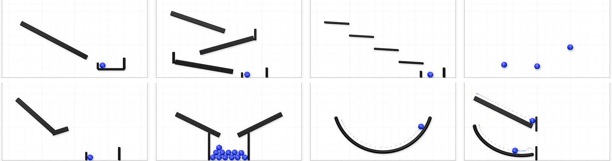

# AirForge

AirForge is a browser sandbox for rigid-body physics. You sketch with a mouse, a finger, or (optionally) your index finger in front of a webcam. Lines become ramps, circles become balls, rectangles become platforms, and smooth bends become curved tracks. Press **Drop** and [Rapier](https://rapier.rs/) simulates the scene. Motion marks leave a dot behind each moving ball every 0.1 s, and a link carries the whole scene to someone else. It suits trying out marble-run ideas, showing how gravity and bounciness change motion, or seeing how Rapier, react-three-fiber, and MediaPipe hand tracking fit together in a small app.

**Demo:** https://skysssup.github.io/airforge/

<picture>
  <source media="(prefers-color-scheme: dark)" srcset="docs/screenshot-dark.png">
  
</picture>

## Try it

1. Open the demo, or run it locally (see [Run locally](#run-locally)).
2. Drag a diagonal line on the sheet. It becomes a ramp.
3. Draw a circle above the ramp to make a ball, or press **Add ball**.
4. Press **Drop** (`D`). Waiting balls start to fall.
5. Press **Restart** (`R`) to put the balls back where they were dropped from, change something, and drop again.

A smooth stroke that bends clearly away from a straight line, such as an arc, a dip, or a wave, becomes a curved track that balls roll along. A nearly straight stroke stays a ramp. If a stroke isn't clearly a line, circle, rectangle, or curve, it stays on screen as a dashed line and you choose what it becomes. A circle's size sets the ball's radius (0.15–1.5 units), and a rectangle drawn at an angle stays tilted.

Click a shape to select it, then drag it somewhere else, turn it with `[` and `]`, or copy it with `Ctrl+D` (`⌘D` on macOS). Each of these is one step for **Undo**. A ball moved into a shape is lifted just clear of it. A released ball belongs to the physics engine, so it can be moved again only after **Freeze** or **Restart**.

## Examples

Each example opens from the **Examples** menu or from its link. A strip under the top bar says what to expect and what to try next. The headless tests in [`src/examples.test.ts`](src/examples.test.ts) check every outcome listed below.



| Example | What it shows | After Drop |
|---|---|---|
| [Ramp & Ball](https://skysssup.github.io/airforge/?example=ramp-and-ball) | The basic loop: one ramp, one ball, and a cup built from three platforms. | The ball rolls down, clears the cup's low wall, and settles inside. |
| [Zigzag](https://skysssup.github.io/airforge/?example=zigzag) | Chaining shapes: three ramps and two upright stops. | The ball runs back and forth and drops into the bin after about 11 seconds. |
| [Staircase](https://skysssup.github.io/airforge/?example=staircase) | Tilted platforms: four steps, each tilted 3.4° downhill. | The ball rolls off each step onto the next and lands in the bin. |
| [Bounce Test](https://skysssup.github.io/airforge/?example=bounce-test) | The Bounce setting (0.85) and dropping several balls at once. | Three balls bounce in place; each bounce peaks at roughly 70% of the one before. |
| [Moon Jump](https://skysssup.github.io/airforge/?example=moon-jump) | The Gravity setting (1.62, close to the Moon's). | The ball skis off a kicker and lands in the bin after about 8 seconds. At gravity 10 the same jump takes about 3 seconds. |
| [Funnel](https://skysssup.github.io/airforge/?example=funnel) | Ball-to-ball collisions with twelve balls. | The balls pour through the funnel and pile up in the box. |
| [Half-Pipe](https://skysssup.github.io/airforge/?example=half-pipe) | A curved track trading height for speed and back. | The ball swings from side to side, each swing a little lower, and settles at the bottom. At Moon gravity (1.62) each swing takes about 2.5 times as long. |
| [Curve Race](https://skysssup.github.io/airforge/?example=curve-race) | A curve against a straight ramp with the same drop: the brachistochrone. | The ball on the curve reaches its post about half a second before the ball on the ramp, though its path is longer. It also wins with Friction at 0, when both balls slide. |

The example files live in [`public/examples/`](public/examples/). They are ordinary scene files, so you can also download one and load it with **Open**.

## Controls

| Action | Mouse, touch, or keyboard |
|---|---|
| Draw a shape | Drag on the sheet |
| Select a shape | Click or tap it |
| Move the selected shape | Drag it (hold `Shift` to snap its center to a half-unit grid), or arrow keys for 0.1 units (`Shift` for 1) |
| Turn the selected shape | `[` and `]` for 5° (`Shift` for 15°), or the buttons beside it for 15° |
| Copy the selected shape | `Ctrl+D` (`⌘D` on macOS), or the button beside it |
| Delete the selected shape | **Delete** button, `Delete`, or `Backspace` |
| Release waiting balls (or drop a new one) | **Drop**, `D` |
| Put released balls back | **Restart**, `R` |
| Pause or resume the simulation | **Pause**, `Space` |
| Stop moving balls where they are | **Freeze**, `F` |
| Show dots every 0.1 s, speed, and height | **Motion**, `M` |
| Undo / redo | **Undo** / **Redo**, `Z` / `Shift+Z`, `Ctrl+Z` / `Ctrl+Shift+Z` (`⌘` on macOS) |
| Discard an unclear stroke, or deselect | `Esc` |
| Change gravity, bounce, and friction | **World** |
| Copy a link to the scene | **Copy link** |
| Switch between light and dark | Theme button (follows the system setting until you pick one) |
| Show all controls | **Help**, `?` |

**Gravity**, **Bounce**, and **Friction** are in the **World** panel. They apply to the whole scene and are saved with it, and the panel also counts the scene's ramps, balls, platforms, and curves. **Clear** removes everything and can be undone. You can rename the scene in the box next to the AirForge name. The status line at the bottom shows the input mode, the pointer's position in world units, and the latest message.

The interface comes in a light and a dark theme. Ramps, platforms, and curves are drawn as ink-colored solids, balls in the accent color. A ball waiting for **Drop** is drawn flat, as a circle with a center mark; once released it becomes a solid ball with a line across it that shows its spin, and it leaves a short fading trail. The selected shape gets an accent outline.

**Motion marks.** Press **Motion** (`M`) and every moving ball leaves a dot every 0.1 s of simulated time, like a strobe photo: wide gaps mean fast, tight gaps mean slow. One ball gets an arrow along its velocity and a panel with its time since release, speed, height above the floor, and highest point so far: the selected ball, or the only moving one when none is selected. Distances are in world units, and one unit is one grid square. AirForge remembers whether motion marks are on.

**Webcam (optional).** Press **Webcam**. The camera image appears faintly behind the sheet, mirrored, with a ring at your index fingertip, so your finger lines up with what it draws. Raise your index finger to draw, then pinch thumb and index (or close your hand) to finish the shape. An open palm cancels the stroke. A gesture takes effect after 3 steady frames, and losing the hand for more than 2 frames cancels the stroke. Only the fingertip's x and y are used. **Use mouse** turns the camera off. Webcam mode needs HTTPS or `localhost` and camera permission. It also needs network access, because it downloads MediaPipe Tasks Vision 1.0.1 from jsDelivr and the hand model from Google Cloud Storage. Video frames are processed in the browser and are not uploaded.

## Scene files and links

**Save** downloads the scene as JSON. **Open** loads one. A file stores the scene name, the gravity, bounce, and friction settings, and every shape's position and size. A ball that is moving when you save is stored at its current position, but its velocity is not stored. A scene with a curve is saved as format version 2 (`"format": "airforge-scene", "version": 2`), which AirForge 1.x cannot open. A scene without curves is still saved as version 1, the format AirForge 1.x saves, so either version can open it. Files larger than 512 KB are refused, as are files with more than 40 objects, curves with more than 64 points, or coordinates beyond ±10,000 units, and the status line says why.

**Copy link** copies a link with the whole scene file in its `#scene=` part, compressed with deflate and encoded as base64url. The scene never goes to a server, because browsers do not send that part of a link. Opening the link checks the scene exactly like opening a file, and a damaged link leaves the current scene alone. The example scenes make links of 400 to 900 characters.

## Run locally

Requires Node.js `^22.22.2`, `^24.15.0`, or `>=26`.

```bash
npm ci
npm run dev        # http://localhost:5173/airforge/
npm test           # unit, component, and headless physics tests (Vitest)
npm run lint       # oxlint
npm run build      # type-check, then production build into dist/
npm run preview    # serve dist/ at http://localhost:4173/airforge/
```

Browser tests use Playwright and run against the production build:

```bash
npx playwright install chromium   # first run only
npm run test:e2e                  # Chromium
npx playwright test --project=webkit
npx playwright test --project=firefox   # needs WebGL; on a Linux machine without a GPU, add --headed under a display server
```

CI runs `npm test`, `npm run lint`, `npm run build`, and the Chromium browser tests on pushes to `main` and on pull requests. Each push to `main` also runs the unit tests again, builds the app, and deploys `dist/` to GitHub Pages.

## How it works

- **Input.** [`src/input/mouse.ts`](src/input/mouse.ts) turns pointer drags into strokes. Mouse and touch points are kept as drawn. Webcam fingertip points are smoothed, and a stroke is cancelled if tracking jumps more than 160 px between frames ([`src/stroke/capture.ts`](src/stroke/capture.ts), [`src/ui/WebcamPanel.tsx`](src/ui/WebcamPanel.tsx)).
- **Recognition.** [`src/shapes/recognize.ts`](src/shapes/recognize.ts) checks for a curve, then a line, a circle, and a rectangle, using geometric tests rather than a trained model. A curve must be open (its ends apart by at least a fifth of its length), bend away from the straight line between its ends (by 12% of that distance and 25 px to one side, or 5% and 20 px to both sides, like a wave), and turn no more than 75° at any corner once wobbles under 6 px are ignored. The other shapes use deviation from a line, radius spread, and corner angles.
- **Curves.** [`src/scene/objects.ts`](src/scene/objects.ts) smooths a curve stroke (Douglas–Peucker, then Chaikin corner cutting) and keeps points at least 0.35 units apart, at most 64 of them. Each segment collides as a capsule, and neighbors share their end spheres, so the track has no seams. The tube is drawn along a centripetal Catmull–Rom spline through the same points.
- **Scene.** [`src/store/appStore.ts`](src/store/appStore.ts) holds the shapes, settings, undo/redo history (50 steps), and selection. A click selects instead of drawing.
- **Physics.** [`src/physics/world.ts`](src/physics/world.ts) describes the collider layout used both by the rendered world ([`src/render/PhysicsWorld.tsx`](src/render/PhysicsWorld.tsx), via `@react-three/rapier`) and by the headless world in the tests. Rapier steps at a fixed 120 Hz; at 60 Hz a fast ball could overlap the next pieces of a tight bend within one step and wedge there. A floor and two side walls keep balls from leaving the scene.
- **View.** A perspective camera looks straight at the drawing plane. It frames both side walls and the floor with a band of ground under it, so balls never leave the screen; on tall screens the extra space goes above the scene ([`src/coords/camera.ts`](src/coords/camera.ts)).
- **Drawing.** The grid, the hatched floor and walls, and the soft shadows of ramps and platforms are an SVG sheet behind a transparent WebGL canvas ([`src/ui/SheetBackdrop.tsx`](src/ui/SheetBackdrop.tsx)). The canvas draws rounded solids lit by three.js's procedural room environment, plus ball shadows, trails, and selection outlines whose widths are set in screen pixels ([`src/render/`](src/render/)). Rounding and shadows are visual only; colliders stay sharp-edged boxes and spheres.

## Limitations

- **2.5D only.** Shapes lie in one plane. Balls move in x and y but not in depth. Ramps, platforms, and curves never move. A track that crosses itself is solid at the crossing, so a ball cannot ride a loop-the-loop.
- **Curves are straight pieces.** A curve collides as a chain of short capsules. At each joint a rolling ball changes direction a little and loses some speed: in Half-Pipe each swing peaks about 20% lower above the bottom than the one before, including the balls' damping. Very tight bends are rounded off when the stroke is smoothed.
- **Repeatability.** Physics runs at a fixed 120 Hz step. In Chromium, three runs of Ramp & Ball came to rest at the same point, (3.37, −2.53), which is where the headless world puts it. Scenes with many colliding balls, such as Funnel, end in a different arrangement each run.
- **Velocities are not kept.** Undo and scene files keep positions but not velocities, so a ball restored mid-flight starts again from rest.
- **Scene size.** A scene holds at most 40 objects.
- **Webcam.** The webcam path was tested with Chrome's simulated camera playing MediaPipe's sample hand photos, not with physical webcams. Hand tracking runs on the main thread. On slow machines, fast hand movement can lose tracking and cancel the stroke.
- **Download size.** The JavaScript bundle is about 3.5 MB (1.2 MB gzipped), mostly Rapier's WebAssembly and three.js, so the build prints a chunk-size warning. The two interface fonts add 54 KB.
- **Browser support.** AirForge needs WebGL 2 and WebAssembly. If WebGL is unavailable it shows a message instead of the scene. The browser tests pass in Chromium, Firefox, and WebKit (Playwright) at desktop and phone sizes, and touch drawing was tested in Chromium's mobile emulation.

## License

MIT © 2026 skysssup. See [`LICENSE`](LICENSE) and [`THIRD_PARTY_NOTICES.md`](THIRD_PARTY_NOTICES.md).
